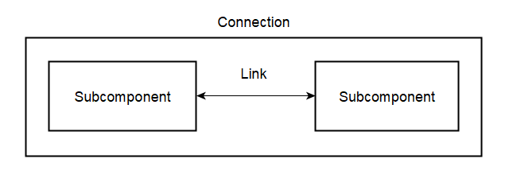
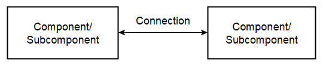

# Customizing an SST Link Object

## Introduction

A link in the Structural Simulation Toolkit (SST) is a simple class used to
deliver messages between components and subcomponents.  It can be configured
in various ways.  For example, it can deliver messages via callback or polling,
and have associated message propagation delays.  However, there is no facility 
to simulate different operating conditions by acting on the messages directly.

There are potential simulations for which this might be desirable.  For 
example, if the link between two components is meant to represent a network
connection, it might be desirable to simulate a severed connection or apply a 
bit error rate (BER) to the data being sent over the link.

This document is intended to provide a way to accomplish this without making
changes to the underlying SST core functionality.

## Defining the Connection Architecture

To support the dynamic modification of messages sent between two components 
or subcomponents, an object referred to as a Connection is defined.  It
consists of two subcomponents and a connecting link, as shown in Figure 1 
below.

<div style="text-align: center;">

</div>
<p style="text-align: center;">
Figure 1.  Connection definition.
</p>

In addition to the methods one would normally expect, the Connection interface 
is defined to contain a method for sending a message through the Connection 
object and another to insert a message handler to be called whenever a message
is received from the link.  Code to operate on the outgoing message can be 
placed in the method that sends the message.

The Connection component is intended to connect two components or
subcomponents in the same way as a link as shown in Figure 2 below.  The 
difference is, since the Connection endpoint is a subcomponent, the Connection
is inserted in a slot within the component/subcomponent, not a port.

<div style="text-align: center;">

</div>
<p style="text-align: center;">
Figure 2.  Connection between components/subcomponents.
</p>

This has the advantage that the number of connections does not have to be 
known at compile time since a single slot can contain multiple subcomponents 
of the same type.  In addition, the slot contents can be defined and added 
dynamically within the simulation configuration file.

It is expected the subcomponents contained within a Connection object will be 
objects of the same class but that is not a requirement so long as they present
the same interface.

## Implementing the Connection Architecture

Definition of a Connection component is done in two parts.  First, the
Connection subcomponent is defined in a C++ .h file.  An example is shown
in Listing 1 below.

```
#ifndef CONNECTION_SUBCOMPONENT_H
#define CONNECTION_SUBCOMPONENT_H

#include <functional>
#include <optional>

#include <sst/core/subcomponent.h>
#include <sst/core/output.h>
#include <sst/core/link.h>

#include "ExampleEvent.h"
#include "Logger.hpp"

using namespace SST;
using namespace SSTLogger;

extern SSTLogger::Logger logger_;

namespace Example
{
    class Connection : public SST::SubComponent
    {
        private:
            // Link to connect to matching subcomponent.
            // The link connects to the opposite subcomponents port.
            //
            SST::Link* link_ = nullptr;

            // Callback provided by the parent component.
            //            
            std::function<void(SST::Event*)> callback_ = nullptr;
            
            // Count sent to the connected subcomponent.
            //
            uint64_t componentId_;      // Id associated with the parent component.
            uint64_t slotNumber_;       // Slot number associated with the subcomponent.

            // Private methods
            //
            // Event handler for incoming messages.
            //
            void messageHandler(SST::Event* event)
            {
                logger_.logTrace(CALL_INFO, "Entering connection messageHandler()\n");

                // Call the specified message handler.
                //
                if (callback_ != nullptr)
                    callback_(event);

                // Don't forget to delete the event when you're done with it.
                // Otherwise you'll get a serious memory leak.
                //
                if (event != nullptr)
                    delete event;

                logger_.logTrace(CALL_INFO, "Leaving connection messageHandler()\n");
            }

        public:

            // Updated constructors.  As of SST V10 no longer pass in a parent.
            // Instead, use a component id.
            //
            Connection(ComponentId_t id) :
                SubComponent(id)
            { 
                componentId_ = id;
                logger_.logDebug(CALL_INFO, "Constructing connection for component id %u\n", componentId_);
            }

            Connection(ComponentId_t id, Params& UNUSED(params)) :
                SubComponent(id)
            {   
                componentId_ = id;     
                logger_.logDebug(CALL_INFO, "Constructing connection for component id %u\n", componentId_);
            }

            virtual ~Connection() {}


            // Method to initialize the connection.  Serves the same purpose as the 
            // start() method in a component.  However, it must bge called explicitly.
            //
            void start(
                uint64_t slotNumber,
                SST::Params &params) 
            {
                logger_.logTrace(CALL_INFO, "Initializing connection, slot number %u in component id %u\n", 
                    slotNumber, componentId_);

                // Process the incoming paramaters.
                //
                slotNumber_ = slotNumber;
                std::string clock = 
                    params.find<std::string>("clock", "1GHz");  // Simulation clock rate.  Default to 1 GHz.
                
                // Configure the attached link.
                //
                link_ = configureLink("link_", clock,
                    new SST::Event::Handler<Connection>(this, &Connection::messageHandler)); 
                
                logger_.logTrace(CALL_INFO, "Connection initialized.\n");
            }


            // Event handler for incoming messages.
            //
            void setMessageHandler(std::function<void(SST::Event*)> callback)
            {
                logger_.logTrace(CALL_INFO, "Entering subcomponent setMessageHandler() method on component %u, slot %u\n",
                    componentId_, 
                    slotNumber_);

                callback_ = callback;

                logger_.logTrace(CALL_INFO, "Leaving subcomponent messageHandler()\n");
            }


            // Send the event message over the link.
            //
            void send(SST::Event* event) 
            {
                logger_.logTrace(CALL_INFO, "Entering subcomponent send() method on component %u, slot %u\n",
                    componentId_, slotNumber_);

                logger_.logInfo(CALL_INFO, "Sending message from component %u, slot %u\n", 
                    componentId_, slotNumber_);
                link_->send(event);

                logger_.logTrace(CALL_INFO, "Leaving subcomponent method sendCount()\n");
            }


            // Clock handler.  This is the method called from the parent clock event.
            //
            virtual void clockTick(Cycle_t) 
            {
                logger_.logTrace(CALL_INFO, "Entering subcomponent method clock\n");
                logger_.logTrace(CALL_INFO, "Leaving subcomponent method clock\n");
            }


            // Document the component ports.
            //
            // Port name, description, vector fo supported events.
            //
            // Port name is just a name.  It can be anything that makes sense but will
            // be used later to refer to this port.
            //
            // Description is just that.  Can be anything.
            //
            // Support events is a std::vector of the names of supported events.  These
            // are initialized as {"lib1.event1", "lib1.event2", "lib2.event3"}.
            // Note these are the names as strings, not types.
            //
            SST_ELI_DOCUMENT_PORTS(
                { "link_", "Message port", {}}
            )

            // Register the subcomponent API.
            //
            SST_ELI_REGISTER_SUBCOMPONENT_API(Example::Connection)

            // Register the subcomponent.
            //
            SST_ELI_REGISTER_SUBCOMPONENT_DERIVED(
                Connection,                         // Name of the class being registered.
                                                    // INSERT_CLASS_NAME
                "example",                          // Element library.  Name of the .so.
                "Connection",                       // Name used to reference the subcomponent.
                                                    // Can be anything but typically set to
                                                    // the class name.
                SST_ELI_ELEMENT_VERSION(1, 0, 0),   // 
                "Example subcomponent",             // Brief subcomponent description
                Example::Connection                 // Name of the subcomponent interface the
                                                    // subcomponent inherits from.  Should be
                                                    // the full parent class name, matching the
                                                    // name used when registering the
                                                    // subcomponent API.
                                                    // "INSERT_FULL_PARENT_CLASS_NAME" or 
                                                    // "INSERT_COMPLETE_NAMESPACE::INSERT_PARENT_CLASS_NAME"
            )
    };
}

#endif
```
<p style="text-align: center;">
Listing 1.  A Minimal Connection Subcomponent Class
</p>

This listing contains the minimum functionality require to implement a
Connection object.  Custom processing of an outgoing message is contained in 
the send() method.   

The Connection object is defined in the Python configuration file as shown
in Listing 2 below.

```
# Create the python Connection class to connect the components.
#
class Connection:
    def __init__(self, subcomponent):
        self._subcomponent = subcomponent
    
    def connect(self, component0, component1, delay):
        '''
        Connects two components through a link.
        Each component is describged by a tuple
        [0] - component object
        [1] - name of the slot array into which the connection subcomponent is to be inserted
        [2] - slot array index into which the connection subcomponent is to be inserted

        Example:  (component0, "slot_", 0) indicates to insert the connection 
        subcomponent at index 0 of the "slot_" vector contained in component 0.
        '''
        self._connection0 = component0[0].setSubComponent(component0[1], self._subcomponent, component0[2])
        self._connection1 = component1[0].setSubComponent(component1[1], self._subcomponent, component1[2])
        self._link = sst.Link("link0")
        self._link.connect((self._connection0, "link_", delay), (self._connection1, "link_", delay))
```
<p style="text-align: center;">Listing 2.  Python Connection Class.</p>

The interface is defined to duplicate how a link is used to connect two
components/subcomponents, making it simple to retrofit existing simulations.

## Using the Connection Object

A simple example showing how to use a Connection object is contained in
Appendix A.  

In this example, messages containing a monotonically increasing value are 
passed between two components.  These components are connected by an 
EvenOddConnection that only passes messages containing an even value payload.  

A message handler that increments a counter when a message is received is 
defined in the parent component.  Once the counter reaches a predefined number 
of messages the simulation is terminated.

Compile the example using the command
```
make clean; make
```

Run the example using the command
```
sst tests/ExampleConfig.py
```

The output should resemble that shown below.
```
Time=0; File=ExampleComponent.cc; Func=ExampleComponent; Line=44; Thread=0 -- [INFO] - Constructing new Example Instance.
Time=0; File=ExampleComponent.cc; Func=configureSubComponents; Line=114; Thread=0 -- [INFO] - Configuring subcomponents.
Time=0; File=ExampleComponent.cc; Func=ExampleComponent; Line=56; Thread=0 -- [INFO] - Successfully initialized clock.
Time=0; File=ExampleComponent.cc; Func=ExampleComponent; Line=44; Thread=0 -- [INFO] - Constructing new Example Instance.
Time=0; File=ExampleComponent.cc; Func=configureSubComponents; Line=114; Thread=0 -- [INFO] - Configuring subcomponents.
Time=0; File=ExampleComponent.cc; Func=ExampleComponent; Line=56; Thread=0 -- [INFO] - Successfully initialized clock.
Time=1000; File=ExampleComponent.cc; Func=clockTick; Line=101; Thread=0 -- [INFO] - Calling clock tick for subcomponents.
Time=1000; File=EvenOddConnection.h; Func=send; Line=139; Thread=0 -- [INFO] - Payload is odd.  Dropping message.
Time=1000; File=ExampleComponent.cc; Func=clockTick; Line=101; Thread=0 -- [INFO] - Calling clock tick for subcomponents.
Time=1000; File=EvenOddConnection.h; Func=send; Line=139; Thread=0 -- [INFO] - Payload is odd.  Dropping message.
Time=2000; File=ExampleComponent.cc; Func=clockTick; Line=101; Thread=0 -- [INFO] - Calling clock tick for subcomponents.
Time=2000; File=EvenOddConnection.h; Func=send; Line=133; Thread=0 -- [INFO] - Payload is even.  Sending message from component 0, slot 0
Time=2000; File=ExampleComponent.cc; Func=clockTick; Line=101; Thread=0 -- [INFO] - Calling clock tick for subcomponents.
Time=2000; File=EvenOddConnection.h; Func=send; Line=133; Thread=0 -- [INFO] - Payload is even.  Sending message from component 1, slot 0
Time=3000; File=ExampleComponent.cc; Func=clockTick; Line=101; Thread=0 -- [INFO] - Calling clock tick for subcomponents.
Time=3000; File=EvenOddConnection.h; Func=send; Line=139; Thread=0 -- [INFO] - Payload is odd.  Dropping message.
Time=3000; File=ExampleComponent.cc; Func=clockTick; Line=101; Thread=0 -- [INFO] - Calling clock tick for subcomponents.
Time=3000; File=EvenOddConnection.h; Func=send; Line=139; Thread=0 -- [INFO] - Payload is odd.  Dropping message.
Time=4000; File=ExampleComponent.cc; Func=clockTick; Line=101; Thread=0 -- [INFO] - Calling clock tick for subcomponents.
Time=4000; File=EvenOddConnection.h; Func=send; Line=133; Thread=0 -- [INFO] - Payload is even.  Sending message from component 0, slot 0
Time=4000; File=ExampleComponent.cc; Func=clockTick; Line=101; Thread=0 -- [INFO] - Calling clock tick for subcomponents.
Time=4000; File=EvenOddConnection.h; Func=send; Line=133; Thread=0 -- [INFO] - Payload is even.  Sending message from component 1, slot 0
Time=5000; File=ExampleComponent.cc; Func=clockTick; Line=101; Thread=0 -- [INFO] - Calling clock tick for subcomponents.
Time=5000; File=EvenOddConnection.h; Func=send; Line=139; Thread=0 -- [INFO] - Payload is odd.  Dropping message.
Time=5000; File=ExampleComponent.cc; Func=clockTick; Line=101; Thread=0 -- [INFO] - Calling clock tick for subcomponents.
Time=5000; File=EvenOddConnection.h; Func=send; Line=139; Thread=0 -- [INFO] - Payload is odd.  Dropping message.
Time=6000; File=ExampleComponent.cc; Func=clockTick; Line=101; Thread=0 -- [INFO] - Calling clock tick for subcomponents.
Time=6000; File=EvenOddConnection.h; Func=send; Line=133; Thread=0 -- [INFO] - Payload is even.  Sending message from component 0, slot 0
Time=6000; File=ExampleComponent.cc; Func=clockTick; Line=101; Thread=0 -- [INFO] - Calling clock tick for subcomponents.
Time=6000; File=EvenOddConnection.h; Func=send; Line=133; Thread=0 -- [INFO] - Payload is even.  Sending message from component 1, slot 0
Time=7000; File=ExampleComponent.cc; Func=clockTick; Line=101; Thread=0 -- [INFO] - Calling clock tick for subcomponents.
Time=7000; File=EvenOddConnection.h; Func=send; Line=139; Thread=0 -- [INFO] - Payload is odd.  Dropping message.
Time=7000; File=ExampleComponent.cc; Func=clockTick; Line=101; Thread=0 -- [INFO] - Calling clock tick for subcomponents.
Time=7000; File=EvenOddConnection.h; Func=send; Line=139; Thread=0 -- [INFO] - Payload is odd.  Dropping message.
Time=8000; File=ExampleComponent.cc; Func=clockTick; Line=101; Thread=0 -- [INFO] - Calling clock tick for subcomponents.
Time=8000; File=EvenOddConnection.h; Func=send; Line=133; Thread=0 -- [INFO] - Payload is even.  Sending message from component 0, slot 0
Time=8000; File=ExampleComponent.cc; Func=clockTick; Line=101; Thread=0 -- [INFO] - Calling clock tick for subcomponents.
Time=8000; File=EvenOddConnection.h; Func=send; Line=133; Thread=0 -- [INFO] - Payload is even.  Sending message from component 1, slot 0
Time=9000; File=ExampleComponent.cc; Func=clockTick; Line=101; Thread=0 -- [INFO] - Calling clock tick for subcomponents.
Time=9000; File=EvenOddConnection.h; Func=send; Line=139; Thread=0 -- [INFO] - Payload is odd.  Dropping message.
Time=9000; File=ExampleComponent.cc; Func=clockTick; Line=101; Thread=0 -- [INFO] - Calling clock tick for subcomponents.
Time=9000; File=EvenOddConnection.h; Func=send; Line=139; Thread=0 -- [INFO] - Payload is odd.  Dropping message.
Time=10000; File=ExampleComponent.cc; Func=clockTick; Line=101; Thread=0 -- [INFO] - Calling clock tick for subcomponents.
Time=10000; File=EvenOddConnection.h; Func=send; Line=133; Thread=0 -- [INFO] - Payload is even.  Sending message from component 0, slot 0
Time=10000; File=ExampleComponent.cc; Func=clockTick; Line=101; Thread=0 -- [INFO] - Calling clock tick for subcomponents.
Time=10000; File=EvenOddConnection.h; Func=send; Line=133; Thread=0 -- [INFO] - Payload is even.  Sending message from component 1, slot 0
Time=11000; File=ExampleComponent.cc; Func=clockTick; Line=101; Thread=0 -- [INFO] - Calling clock tick for subcomponents.
Time=11000; File=EvenOddConnection.h; Func=send; Line=139; Thread=0 -- [INFO] - Payload is odd.  Dropping message.
Time=11000; File=ExampleComponent.cc; Func=clockTick; Line=101; Thread=0 -- [INFO] - Calling clock tick for subcomponents.
Time=11000; File=EvenOddConnection.h; Func=send; Line=139; Thread=0 -- [INFO] - Payload is odd.  Dropping message.
Time=12000; File=ExampleComponent.cc; Func=clockTick; Line=101; Thread=0 -- [INFO] - Calling clock tick for subcomponents.
Time=12000; File=EvenOddConnection.h; Func=send; Line=133; Thread=0 -- [INFO] - Payload is even.  Sending message from component 0, slot 0
Time=12000; File=ExampleComponent.cc; Func=clockTick; Line=101; Thread=0 -- [INFO] - Calling clock tick for subcomponents.
Time=12000; File=EvenOddConnection.h; Func=send; Line=133; Thread=0 -- [INFO] - Payload is even.  Sending message from component 1, slot 0
Time=13000; File=ExampleComponent.cc; Func=clockTick; Line=101; Thread=0 -- [INFO] - Calling clock tick for subcomponents.
Time=13000; File=EvenOddConnection.h; Func=send; Line=139; Thread=0 -- [INFO] - Payload is odd.  Dropping message.
Time=13000; File=ExampleComponent.cc; Func=clockTick; Line=101; Thread=0 -- [INFO] - Calling clock tick for subcomponents.
Time=13000; File=EvenOddConnection.h; Func=send; Line=139; Thread=0 -- [INFO] - Payload is odd.  Dropping message.
Time=14000; File=ExampleComponent.cc; Func=clockTick; Line=101; Thread=0 -- [INFO] - Calling clock tick for subcomponents.
Time=14000; File=EvenOddConnection.h; Func=send; Line=133; Thread=0 -- [INFO] - Payload is even.  Sending message from component 0, slot 0
Time=14000; File=ExampleComponent.cc; Func=clockTick; Line=101; Thread=0 -- [INFO] - Calling clock tick for subcomponents.
Time=14000; File=EvenOddConnection.h; Func=send; Line=133; Thread=0 -- [INFO] - Payload is even.  Sending message from component 1, slot 0
Time=15000; File=ExampleComponent.cc; Func=clockTick; Line=101; Thread=0 -- [INFO] - Calling clock tick for subcomponents.
Time=15000; File=EvenOddConnection.h; Func=send; Line=139; Thread=0 -- [INFO] - Payload is odd.  Dropping message.
Time=15000; File=ExampleComponent.cc; Func=clockTick; Line=101; Thread=0 -- [INFO] - Calling clock tick for subcomponents.
Time=15000; File=EvenOddConnection.h; Func=send; Line=139; Thread=0 -- [INFO] - Payload is odd.  Dropping message.
Simulation is complete, simulated time: 15 ns
```

If you examine the output you can see that only messages containing even value 
payloads are passed through the connection object.  By modifying the Connection
subcomponent this example can be easily modified for different behaviors (for
example, passing messages with odd value payloads or dropping messages 
randomly).

# Appendix A - Connection Object Example Source Code.

ExampleComponent.cc

```
// Component definition.
//
#include <iostream>
#include <functional>
#include "ExampleComponent.h"
#include "EvenOddConnection.h"
#include "ExampleEvent.h"
#include "Logger.hpp"

// Declare namespaces.
//
using namespace Example;
using namespace SSTLogger;

// Initialize the logger.
// Prefix contains Time, File, Function, Line, and Thread
// Log all messages of Info and above to STDOUT.
//
Logger logger_ = Logger("Time=@t; File=@f; Func=@p; Line=@l; Thread=@I -- ", Logger::LogLevel::Info, Logger::LogLocation::STDOUT);

// Component constructor.
//
ExampleComponent::ExampleComponent(SST::ComponentId_t id, SST::Params &params) :
    SST::Component(id),
    componentId_(id),
    clockTickCount_(0),
    clockCount_(0)
{
    // Read in the parameters from the python config file.  See SST_ELI_DOCUMENT_PARAMS
    // for an explanation of what each parameter represents.
    //
    std::string clock = 
        params.find<std::string>("clock", "1GHz");      // Clock defaults to 1GHz.
    clockTicks_ = static_cast<uint64_t>(
        params.find<int>("clockTicks", 5));             // Maximum clock ticks default to 10

    logger_.logTrace(CALL_INFO, "Entering constructor for component id %lu\n", componentId_);
 
    // Initialize the debug output instance.
    // Strings for debug output use the printf format.
    //
    logger_.logDebug(CALL_INFO, "Parameters successfully read from config file.\n");
    logger_.logDebug(CALL_INFO, "clockTicks = %lu\n", clockTicks_);
    logger_.logInfo(CALL_INFO, "Constructing new Example Instance.\n");

    // Configure the subcomponents.  The slot name is taken from where the 
    // subcomponent slot is documented in the component .h file.
    //
    connections_ = configureSubComponents(params);

    // Configure the component clock.
    //
    logger_.logDebug(CALL_INFO, "Clock rate is: %s\n", clock.c_str());
    registerClock(clock,
        new SST::Clock::Handler<ExampleComponent>(this, &ExampleComponent::clockTick));
    logger_.logInfo(CALL_INFO, "Successfully initialized clock.\n");

    // Register this component with the simulation.
    //
    registerAsPrimaryComponent();
    logger_.logDebug(CALL_INFO, "Component registered as primary component.\n");
    
    primaryComponentDoNotEndSim();
    logger_.logDebug(CALL_INFO, "Simulation notified it should not end.\n");
    logger_.logTrace(CALL_INFO, "Leaving constructor for component id %lu\n", componentId_);
}


// Called after all components have been constructed and initialization
// has completed, but before simulation time has begin.
//
// This is where you should do any other initialization that needs done
// but could be accomplished in the constructure.
//
void ExampleComponent::setup(void)
{
    logger_.logTrace(CALL_INFO, "Entering setup for component id %lu\n", componentId_);
    logger_.logTrace(CALL_INFO, "Leaving setup for component id %lu\n", componentId_);
}


// Called after the simulation is complete but before the objects are
// destroyed.  This is a good place to print out statistics.
//
void ExampleComponent::finish(void)
{
    logger_.logTrace(CALL_INFO, "Entering finish for component id %lu\n", componentId_);
    logger_.logTrace(CALL_INFO, "Leaving finish for component id %lu\n", componentId_);
}


// Clock event handler.
//
bool ExampleComponent::clockTick(SST::Cycle_t cycle)
{
    logger_.logTrace(CALL_INFO, "Entering clock for component id %lu\n", componentId_);
    bool done = false;

    // Call clockTick for each of the subcomponents.
    //
    logger_.logInfo(CALL_INFO, "Calling clock tick for subcomponents.\n");
    for ( auto connection : connections_) 
    {
        connection->clockTick(cycle);

        clockTickCount_++;
        connection->send(new ExampleEvent(clockTickCount_));
    }
    return done;
}

std::vector<EvenOddConnection*> ExampleComponent::configureSubComponents(SST::Params &params)
{
    logger_.logInfo(CALL_INFO, "Configuring subcomponents.\n");

    std::vector<EvenOddConnection*> connections {};

    SubComponentSlotInfo* info = getSubComponentSlotInfo("slot_");
    if ( !info ) 
    {
        // No defined subcomponents.  Print an error message and exit.
        //
        logger_.logFatal(CALL_INFO, "Must specify at least one SubComponent for slot.\n");
    }
    else
    {
        // Create all the defined subcomponents.
        //
        long unsigned int maxSlot = info->getMaxPopulatedSlotNumber();
        logger_.logDebug(CALL_INFO, "There are %lu subcomponent slot entries\n", maxSlot + 1);
        for (int i = 0; i <= maxSlot; i++)
        {
            // Check to see if the current slot is populated.
            //
            logger_.logDebug(CALL_INFO, "Examining subcomponent slot entry %d\n", i);
            if (!info->isPopulated(i))
            {
                logger_.logDebug(CALL_INFO, "Slot %d is not populated\n", i);
                continue;
            }

            // Create the subcomponent for this slot.
            //
            logger_.logDebug(CALL_INFO, "Loading subcomponent into slot entry %d\n", i);  
            EvenOddConnection* exSubComponent = info->create<EvenOddConnection>(i, ComponentInfo::SHARE_PORTS);
            logger_.logDebug(CALL_INFO, "Example subcomponent created.\n");

            // Define the message handler to be attached to the subcomponent.
            // The message handler is passed in as a lambda so you don't have
            // to declare it as static.
            //
            logger_.logDebug(CALL_INFO, "Create event handler.\n");
            exSubComponent->setMessageHandler([this](SST::Event* event)-> void
            { 
                logger_.logTrace(CALL_INFO, "Entering message handler.\n");

                clockCount_++;
                if (clockCount_ >= clockTicks_)
                {
                    primaryComponentOKToEndSim();
                }
                
                logger_.logTrace(CALL_INFO, "Leaving message handler.\n");
            });

            // Initialize and store the slot on the vector.
            //
            logger_.logDebug(CALL_INFO, "Initialize and store on the vector.\n");
            exSubComponent->start(i, params);
            connections.push_back(exSubComponent);

            logger_.logDebug(CALL_INFO, "Subcomponent %u initialized.\n", i);
        }
    }
    return connections;
}
```
ExampleComponent.h
```
#ifndef EXAMPLE_COMPONENT_H
#define EXAMPLE_COMPONENT_H

#include <sst/core/component.h>
#include <sst/core/subcomponent.h>
#include <sst/core/link.h>
#include <sst/core/output.h>
#include <sst/core/params.h>

#include "Logger.hpp"
#include "EvenOddConnection.h"

namespace Example
{
    // Remember, all components inherit from SST::Component
    //
    class ExampleComponent : public SST::Component
    {
        public:
            // Constructor/Destructor
            //
            ExampleComponent(SST::ComponentId_t id, SST::Params &params);
            ~ExampleComponent() {}

            // Standard SST::Component functions.  These all need to
            // be implemented in the component, even if they are empty.
            //
            void setup(void);
            void finish(void);

            // Slot to hold a subcomponent.
            //
            std::vector<EvenOddConnection*> connections_;

            // Clock handler.  This is the method called from the clock event.
            //
            bool clockTick(SST::Cycle_t cycle);

            // Shared documentation macros. 
            //
            SST_ELI_DOCUMENT_PARAMS(
                { "clock", "Component clock rate", "1GHz" },
                { "clockTicks", "Number of times the handler is called before ending.", "10" }
            )
            
            SST_ELI_REGISTER_COMPONENT(
                ExampleComponent,                       // Class name
                "example",                              // Library name (the *.so)
                "ExampleComponent",                     // Named use to reference the component.  This can be
                                                        // whatever you want it to be and will be referenced
                                                        // in the python configuration file.
                SST_ELI_ELEMENT_VERSION( 1, 0, 0 ),     // Version number
                "Clock element example",                // Description                 
                COMPONENT_CATEGORY_UNCATEGORIZED        // Component category
            )

            // Document the subcomponent slots.
            //
            SST_ELI_DOCUMENT_SUBCOMPONENT_SLOTS(
                // Slot name, description, slot type
                //
                // Slot name is just a name.  It can be anything that makes sense but will
                // be used later to refer to this slot.
                //
                // Description is just that.  Can be anything.
                //
                // Slot type is the subcomponent fully qualified class name.
                //
                {"slot_", "Slot to hold a subcomponent", "Example::EvenOddConnection"}
            )

        private:

            // Member variables for this example.
            //
            uint64_t componentId_;      // SST supplied component id.
            uint64_t clockTickCount_;   // 
            uint32_t clockCount_;       //
            uint64_t clockTicks_;       // Maximum number of allowed clock ticks.

            void messageHandler(SST::Event* event);
            std::vector<EvenOddConnection*> configureSubComponents(SST::Params &params);
            
    };  // Close the class
}   // Close the namespace

#endif
```
EvenOddConnection.h
```
#ifndef EVENODDCONNECTION_SUBCOMPONENT_H
#define EVENODDCONNECTION_SUBCOMPONENT_H

#include <functional>
#include <optional>

#include <sst/core/subcomponent.h>
#include <sst/core/output.h>
#include <sst/core/link.h>

#include "ExampleEvent.h"
#include "Logger.hpp"

using namespace SST;
using namespace SSTLogger;

extern SSTLogger::Logger logger_;

namespace Example
{
    class EvenOddConnection : public SST::SubComponent
    {
        private:
            // Link to connect to matching subcomponent.
            // The link connects to the opposite subcomponents port.
            //
            SST::Link* link_ = nullptr;

            // Callback provided by the parent component.
            //            
            std::function<void(SST::Event*)> callback_ = nullptr;
            
            // Count sent to the connected subcomponent.
            //
            uint64_t componentId_;      // Id associated with the parent component.
            uint64_t slotNumber_;       // Slot number associated with the subcomponent.

            // Private methods
            //
            // Event handler for incoming messages.
            //
            void messageHandler(SST::Event* event)
            {
                logger_.logTrace(CALL_INFO, "Entering connection messageHandler()\n");

                // Call the specified message handler.
                //
                if (callback_ != nullptr)
                    callback_(event);

                // Don't forget to delete the event when you're done with it.
                // Otherwise you'll get a serious memory leak.
                //
                if (event != nullptr)
                    delete event;

                logger_.logTrace(CALL_INFO, "Leaving connection messageHandler()\n");
            }

        public:

            // Updated constructors.  As of SST V10 no longer pass in a parent.
            // Instead, use a component id.
            //
            EvenOddConnection(ComponentId_t id) :
                SubComponent(id)
            { 
                componentId_ = id;
                logger_.logDebug(CALL_INFO, "Constructing connection for component id %u\n", componentId_);
            }

            EvenOddConnection(ComponentId_t id, Params& UNUSED(params)) :
                SubComponent(id)
            {   
                componentId_ = id;     
                logger_.logDebug(CALL_INFO, "Constructing connection for component id %u\n", componentId_);
            }

            virtual ~EvenOddConnection() {}


            // Method to initialize the connection.  Serves the same purpose as the 
            // start() method in a component.  However, it must bge called explicitly.
            //
            void start(
                uint64_t slotNumber,
                SST::Params &params) 
            {
                logger_.logTrace(CALL_INFO, "Initializing connection, slot number %u in component id %u\n", 
                    slotNumber, componentId_);

                // Process the incoming paramaters.
                //
                slotNumber_ = slotNumber;
                std::string clock = 
                    params.find<std::string>("clock", "1GHz");  // Simulation clock rate.  Default to 1 GHz.
                
                // Configure the attached link.
                //
                link_ = configureLink("link_", clock,
                    new SST::Event::Handler<EvenOddConnection>(this, &EvenOddConnection::messageHandler)); 
                
                logger_.logTrace(CALL_INFO, "Connection initialized.\n");
            }


            // Event handler for incoming messages.
            //
            void setMessageHandler(std::function<void(SST::Event*)> callback)
            {
                logger_.logTrace(CALL_INFO, "Entering subcomponent setMessageHandler() method on component %u, slot %u\n",
                    componentId_, 
                    slotNumber_);

                callback_ = callback;

                logger_.logTrace(CALL_INFO, "Leaving subcomponent messageHandler()\n");
            }


            // Send the event message over the link.
            //
            void send(SST::Event* event) 
            {
                logger_.logTrace(CALL_INFO, "Entering subcomponent send() method on component %u, slot %u\n",
                    componentId_, slotNumber_);

                // Only send the message if the payload is an even number.
                //                
                int32_t payload = static_cast<ExampleEvent*>(event)->getPayload();
                if ((payload %2) == 0)
                {
                    logger_.logInfo(CALL_INFO, "Payload is even.  Sending message from component %u, slot %u\n", 
                        componentId_, slotNumber_);
                    link_->send(event);
                }
                else
                {
                    logger_.logInfo(CALL_INFO, "Payload is odd.  Dropping message.\n");
                }

                logger_.logTrace(CALL_INFO, "Leaving subcomponent method sendCount()\n");
            }


            // Clock handler.  This is the method called from the parent clock event.
            //
            virtual void clockTick(Cycle_t) 
            {
                logger_.logTrace(CALL_INFO, "Entering subcomponent method clock\n");
                logger_.logTrace(CALL_INFO, "Leaving subcomponent method clock\n");
            }


            // Document the component ports.
            //
            // Port name, description, vector fo supported events.
            //
            // Port name is just a name.  It can be anything that makes sense but will
            // be used later to refer to this port.
            //
            // Description is just that.  Can be anything.
            //
            // Support events is a std::vector of the names of supported events.  These
            // are initialized as {"lib1.event1", "lib1.event2", "lib2.event3"}.
            // Note these are the names as strings, not types.
            //
            SST_ELI_DOCUMENT_PORTS(
                { "link_", "Message port", {}}
            )

            // Register the subcomponent API.
            //
            SST_ELI_REGISTER_SUBCOMPONENT_API(Example::EvenOddConnection)

            // Register the subcomponent.
            //
            SST_ELI_REGISTER_SUBCOMPONENT_DERIVED(
                EvenOddConnection,                  // Name of the class being registered.
                                                    // INSERT_CLASS_NAME
                "example",                          // Element library.  Name of the .so.
                "EvenOddConnection",                // Name used to reference the subcomponent.
                                                    // Can be anything but typically set to
                                                    // the class name.
                SST_ELI_ELEMENT_VERSION(1, 0, 0),   // 
                "Example subcomponent",             // Brief subcomponent description
                Example::EvenOddConnection          // Name of the subcomponent interface the
                                                    // subcomponent inherits from.  Should be
                                                    // the full parent class name, matching the
                                                    // name used when registering the
                                                    // subcomponent API.
                                                    // "INSERT_FULL_PARENT_CLASS_NAME" or 
                                                    // "INSERT_COMPLETE_NAMESPACE::INSERT_PARENT_CLASS_NAME"
            )
    };
}

#endif
```
ExampleEvent.h

```
#ifndef _EXAMPLE_EVENT_H
#define _EXAMPLE_EVENT_H

// Basic include files from SST
//
#include <sst/core/event.h>
#include "Logger.hpp"

using namespace SSTLogger;

extern SSTLogger::Logger logger_;

namespace Example
{
    // Class must inherit from SST::Event
    //
    class ExampleEvent : public SST::Event
    {
    public:
        // Constructor
        //
        ExampleEvent(const uint32_t payload_value) : 
            SST::Event(),
            payload_(payload_value) { payload_ = payload_value; }

        // Return the payload
        //
        uint32_t getPayload() const { return payload_; }

    private:

        // Private variables.
        //
        uint32_t payload_;

        // Default constructor is private.
        // This is required for serialization to work.
        //
        ExampleEvent() : 
            SST::Event() {}

        // Serialization code.  Serializes data before sending it out
        // over the link.
        //
        void serialize_order(SST::Core::Serialization::serializer &ser) override
        {
            Event::serialize_order(ser);
            ser & payload_; // Not sure what & means in this context but based
                            // upon other examples, it looks like you create a
                            // list of values to be serialized using the & 
                            // operator.  So the list would look like:
                            // ser & payload0;
                            // ser & payload1;
                            // etc.
        }
        ImplementSerializable(ExampleEvent);
    };
}

#endif
```
Logger.hpp

```
#ifndef LOGGER_HPP
#define LOGGER_HPP

#include <sst/core/output.h>
#include <stdio.h>

namespace SSTLogger
{
    class Logger
    {
    public:
        enum LogLevel {
            Fatal = 0,
            Error = 100,
            Warn  = 200,
            Info  = 300,
            Debug = 400,
            Trace = 500
        };

        enum LogLocation {
            NONE,       // No output
            STDOUT,     // Print to stdout
            STDERR,     // Print to STDERR
            FILE        // Print to a file
        };

        SST::Output output_;

        // Constructors.
        //
        Logger()
        {
            output_ = SST::Output("", LogLevel::Trace, 0x00, static_cast<SST::Output::output_location_t>(LogLocation::NONE));
        }

        Logger(const std::string prefix, LogLevel logLevel, LogLocation location, const std::string& logFileName = "")
        {
            output_ = SST::Output(prefix, logLevel, 0x00, static_cast<SST::Output::output_location_t>(location), logFileName);
        }

        // Methods used to log the various log levels.
        // The first three parameters (line, file, and func) are provided by the SST CALL_INFO macro.
        //
        template<typename... Args> 
        void logFatal(
            uint32_t line, const char* file, const char* func,
            const char* format, Args... arg)
        {
            std::string fmt = "[FATAL] - " + std::string(format);
            output_.fatal(line, file, func, 0x00, fmt.c_str(), arg...);
        }

        template<typename... Args> 
        void logError(
            uint32_t line, const char* file, const char* func,
            const char* format, Args... arg)
        {
            std::string fmt = "[ERROR] - " + std::string(format);
            output_.verbose(line, file, func, LogLevel::Error, 0x00, fmt.c_str(), arg...);
        }

        template<typename... Args>
        void logWarn(
            uint32_t line, const char* file, const char* func,
            const char* format, Args... arg)
        {
            std::string fmt = "[WARN] - " + std::string(format);
            output_.verbose(line, file, func, LogLevel::Warn, 0x00, fmt.c_str(), arg...);
        }

        template<typename... Args>    
        void logInfo(
            uint32_t line, const char* file, const char* func,
            const char* format, Args... arg)
        {
            std::string fmt = "[INFO] - " + std::string(format);
            output_.verbose(line, file, func, LogLevel::Info, 0x00, fmt.c_str(), arg...);
        }

        template<typename... Args> 
        void logDebug(
            uint32_t line, const char* file, const char* func,
            const char* format, Args... arg)
        {
            std::string fmt = "[DEBUG] - " + std::string(format);
            output_.verbose(line, file, func, LogLevel::Debug, 0x00, fmt.c_str(), arg...);
        }

        template<typename... Args>
        void logTrace(
            uint32_t line, const char* file, const char* func, 
            const char* format, Args... arg)
        {
            std::string fmt = "[TRACE] - " + std::string(format);
            output_.verbose(line, file, func, LogLevel::Trace, 0x00, fmt.c_str(), arg...);
        }
    };
}

#endif
```
Makefile

```
CXX=$(shell sst-config --CXX)
CXXFLAGS=$(shell sst-config --ELEMENT_CXXFLAGS)
LDFLAGS=$(shell sst-config --ELEMENT_LDFLAGS)

all: libexample.so install

libexample.so: ExampleComponent.cc\
		 	   ExampleComponent.h\
			   ExampleEvent.h\
			   EvenOddConnection.h
	$(CXX) $(CXXFLAGS) $(LDFLAGS) -o $@ $<

install:
	sst-register example example_LIBDIR=$(CURDIR)

clean:
	rm -f *.o libexample.so
```
ExampleConfig.py
```
# Execute from the command line with the command:
#   sst exampleConfig.py 2>&1 | tee test.log
#
import sst

# Create the python Connection class to connect the components.
#
class Connection:
    def __init__(self, subcomponent):
        self._subcomponent = subcomponent
    
    def connect(self, component0, component1, delay):
        '''
        Connects two components through a link.
        Each component is describged by a tuple
        [0] - component object
        [1] - name of the slot array into which the connection subcomponent is to be inserted
        [2] - slot array index into which the connection subcomponent is to be inserted
        Example:  (component0, "slot_", 0) indicates to insert the connection subcomponent at index 0
        of the "slot_" vector contained in component 0.
        '''
        self._connection0 = component0[0].setSubComponent(component0[1], self._subcomponent, component0[2])
        self._connection1 = component1[0].setSubComponent(component1[1], self._subcomponent, component1[2])
        self._link = sst.Link("link0")
        self._link.connect((self._connection0, "link_", delay), (self._connection1, "link_", delay))


# Initialize local variables.
#
clock = "1GHz"

# Define the component.
#
# The parameters are a dictionary and can be any key/value pair defined
# by the component itself.
#
# The second parameter is <library>.<registered_name> specified in
# SST_ELI_REGISTER_COMPONENT.
#
component0 = sst.Component("component0", "example.ExampleComponent")
component0.addParams({
    "clock"      : clock,
    })

component1 = sst.Component("component1", "example.ExampleComponent")
component1.addParams({
    "clock"      : clock,
})

connection = Connection("example.EvenOddConnection")   # Defines the subcomponent representing the connection.
connection.connect((component0, "slot_", 0), (component1, "slot_", 0), "5ns")
```
